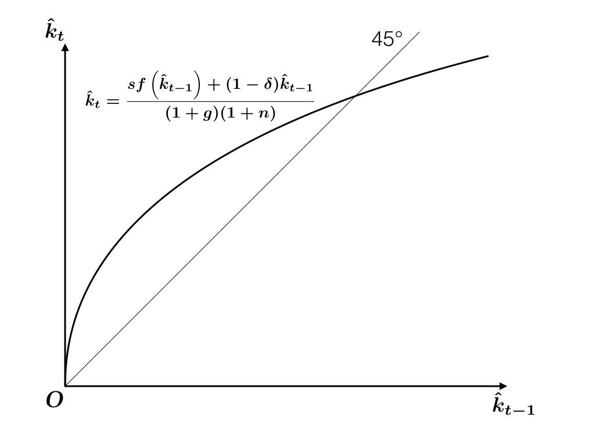
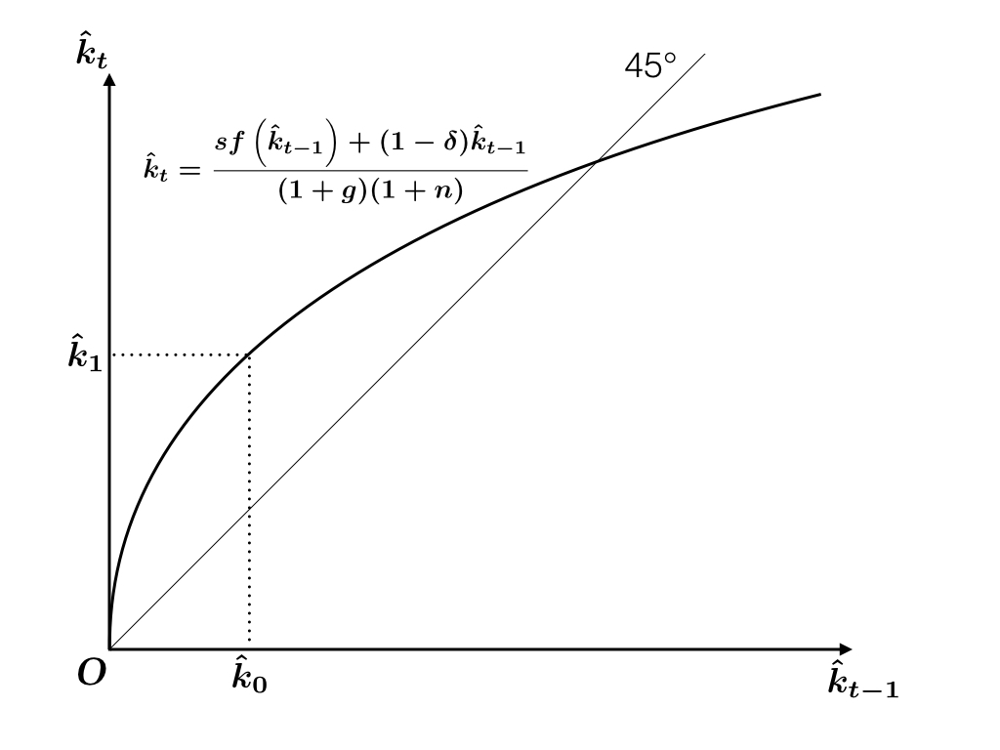
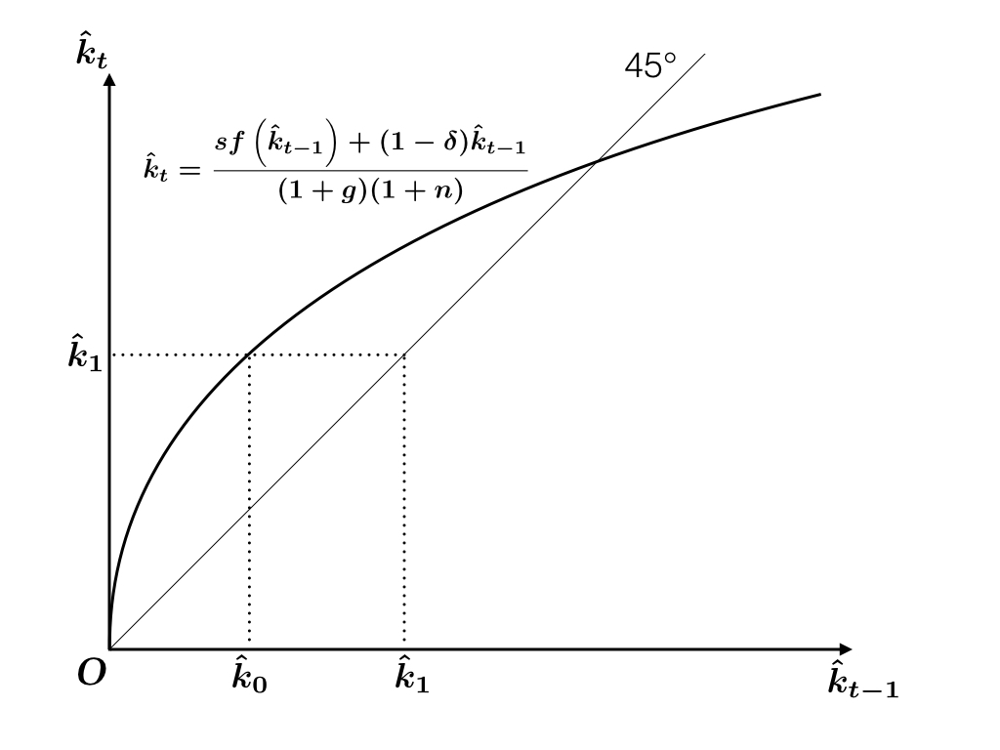
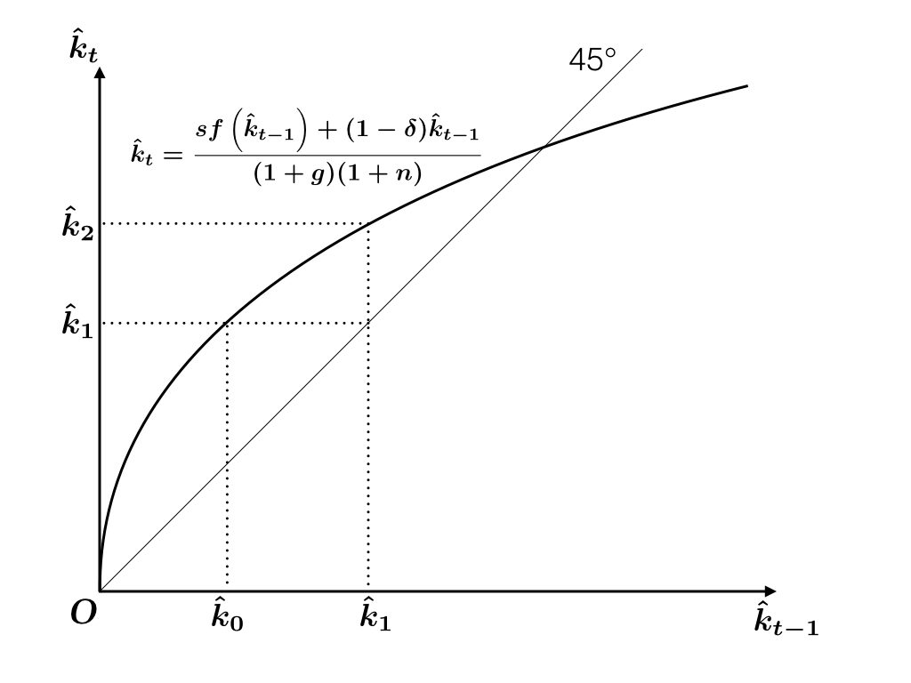
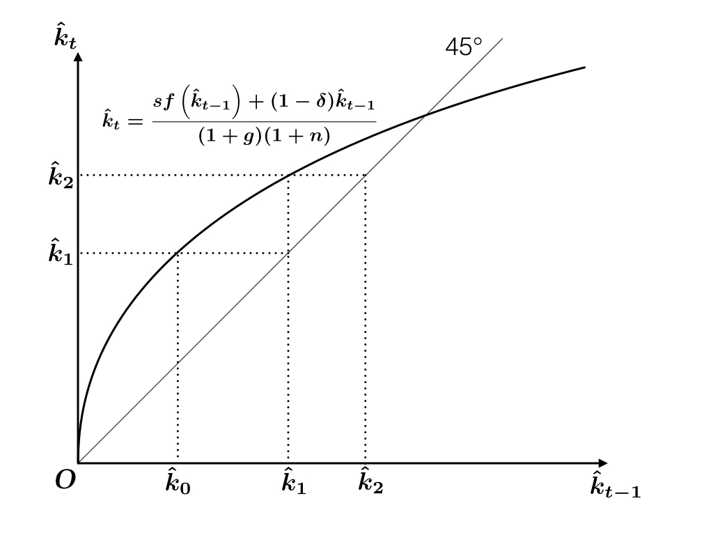
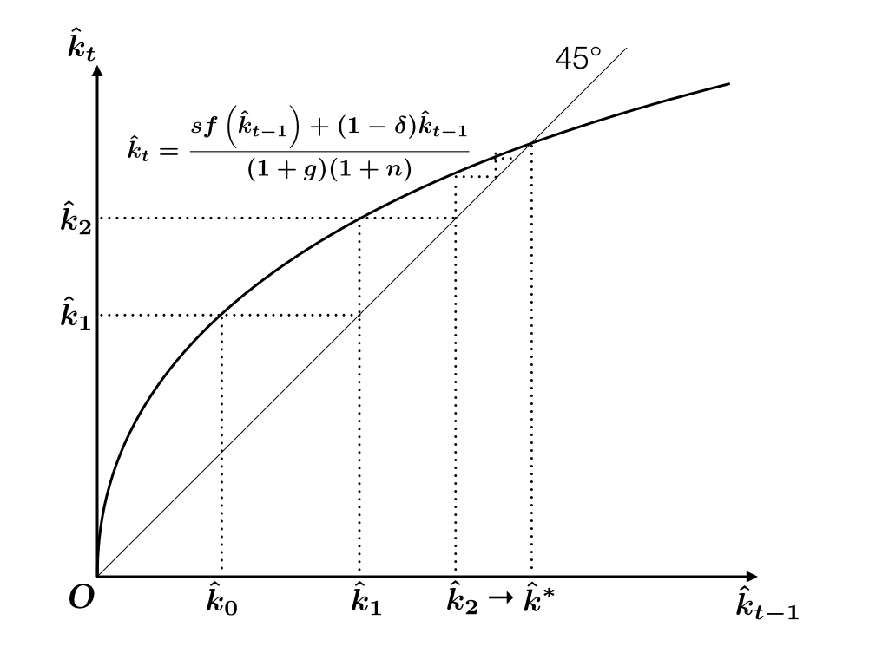

```{r setup, include=FALSE}
knitr::opts_chunk$set(fig.align = 'center')
source("../R/utils.R")
library(tidyverse)
```

<div style="margin-top: -2.5em"></div>

## Continuous-time v. Discrete-time

We have studied continuous-time macroeconomic models. Here is a summary of our modelling strategy: We

1. model economic activities in a very short period of time $[t, t + \Delta t)$
1. derive a system of differential equation(s) by taking $\Delta t \to 0$
1. describe the behavior of the economy diagramatically
1. observe what the economy looks like in transition and in the limit

---

## Continuous-time v. Discrete-time (cont'd)

Continuous-time models are convenient because solutions are often simpler than discrete-time models.

For instance, see growth rate formulas: 

$$\begin{aligned}
  e^{a} e^{b} &= e^{a + b} \\
  (1 + a)(1 + b) &= 1 + a + b + ab
\end{aligned}$$

Also, phase-diagramatic analysis may not work in the discrete-time models.

---

## Continuous-time v. Discrete-time (cont'd)

In spite of the downsides of discrete-time models, many papers use them probably because 

* its interpretation is straightforward;
* time series analysis works better (note that all available data are in discrete time).

Since analysts can choose whichever is convenient, you also need to understand both schemes.

---

`r section("Discrete-time Models")`

---

background-image: url("discrete-time/discrete-time.001.jpeg")

---


background-image: url("discrete-time/discrete-time.002.jpeg")

---

background-image: url("discrete-time/discrete-time.003.jpeg")

---

## Notation and goal

Today, let's pick the third choice.

* Time is discrete and extends from $0$ to $\infty$.
* Period between time points $t - 1$ and $t$ is called "Period $t$".
* For stock variables, notation like $K_t$ denotes the end-of-period balance.

We need to find a rule that governs the development of 

$$K_0, K_1, \dots, \quad Y_1, Y_2, \dots$$

etc. Let's first study the discrete-time Solow model.


---

`r section('Disrete-time Ramsey Model')`

---

## Exogenous growth

Let's suppose that knowledge $A$ and labor $L$ grow exogenously. In discrete-time models, 
this assumption is expressed as

$$\begin{aligned}
  A_t &= (1 + g) A_{t-1}\\
  L_t &= (1 + n) L_{t-1}, \qquad t = 1, 2, \dots
\end{aligned}$$

---

## Production and investment

The firms produce output, employing what is available at the beginning of the period, or
equivalently, what was available at the end of the previous period.

$$Y_t = F(K_{t-1}, A_{t-1} L_{t-1})$$

$F$ is a CRS production function and $Y$ denotes aggregate production.

We assume a closed free economy with a constant saving rate

$$S_t = I_t = sY_t$$


---

## Capital Accumulation

Net investment $K_{t} - K_{t-1}$ is by definition

$$\begin{aligned}
K_t - K_{t-1} 
  &= I_t - \delta K_{t-1}\\
  &= sY_t - \delta K_{t-1}\\
  &= sF(K_{t-1}, A_{t-1} L_{t-1}) - \delta K_{t-1}
\end{aligned}$$

where $\delta$ is the depreciation rate. By rearranging,

$$K_t = sF(K_{t-1}, A_{t-1} L_{t-1}) + (1 - \delta) K_{t-1}$$


---

## Effective labor

Define

$$\hat k_t = \frac{K_t}{A_t L_t}$$ 

and 

$$\hat{y}_t = f\left( \hat k_t \right) = F\left(\hat{k}_t, 1    \right)$$

---

## Capital accumulation 

Divide by $A_{t-1} L_{t-1}$ both sides of
$$K_t = sF(K_{t-1}, A_{t-1} L_{t-1}) + (1 - \delta) K_{t-1}$$

The left-hand side 

$$\frac{K_t}{A_{t-1} L_{t-1}}
=
\frac{K_t}{A_{t} L_{t}} \frac{A_{t} L_{t}}{A_{t-1} L_{t-1}}
=
\hat{k}_t (1 + g)(1 + n)$$

The right hand side

$$\frac{sF(K_{t-1}, A_{t-1} L_{t-1}) + (1 - \delta) K_{t-1}}{A_{t-1} L_{t-1}}
= sf\left(\hat{k}_{t-1}\right) + (1 - \delta) \hat{k}_{t-1}$$

---

## Capital accumulation

We obtain

$$\hat{k}_t
= \frac{sf\left(\hat{k}_{t-1}\right) + (1 - \delta) \hat{k}_{t-1}}{(1+g)(1+n)}$$

Or

$$\hat{k}_t - \hat{k}_{t-1}
= \frac{sf\left(\hat{k}_{t-1}\right) - (\delta + g + n + gn) \hat{k}_{t-1}}{(1+g)(1+n)}$$


---

## Break-even investment

$$\hat{k}_t > \hat{k}_{t-1} \Leftrightarrow sf\left(\hat{k}_{t-1}\right) > (\delta + g + n + gn) \hat{k}_{t-1}$$

$$\hat{k}_t < \hat{k}_{t-1} \Leftrightarrow sf\left(\hat{k}_{t-1}\right) < (\delta + g + n + gn) \hat{k}_{t-1}$$


Break-even investment in discrete-time model is $(\delta + g + n + gn)\hat{k}$, which is slightly 
larger than the continuous-time counterpart. 

This difference comes from the difference between nominal and effective rates. When $g$ and $n$ are very small,
then we can ignore the difference: 

$$\delta + g + n + gn \simeq \delta + g + n$$

---

## Dynamics

Analysis analogous to continuous-time Solow model may not work since 
we haven't ruled out a scenario that the sign conditions alternate

$$k_{t-1} - k_t < 0, \quad k_t - k_{t+1} >0 , \quad k_{t+1} - k_{t+2} < 0, \dots$$

This doesn't happen in continuous-time models in which stock variables develop continuously.

In discrete-time models, the following "staircase" diagram might work better.

---

## Policy function

```{r, echo=FALSE}

```

---

## Policy function

```{r, echo=FALSE}

```

---

## 45 degree line

```{r, echo=FALSE}

```

---

## $t = 1 \to 2$

```{r, echo=FALSE}

```

---

## 45 degree line

```{r, echo=FALSE}

```


---

## Continue this argument to get convergence

```{r, echo=FALSE}

```


---

## Steady state

We get convergence to the steady state value

$$\hat{k}_t \to \hat{k}^*$$


In the steady state, balanced growth is achieved:

$$K_t = A_t L_t \hat{k}^*$$

$$Y_t = A_t L_t f\left( \hat{k}^* \right)$$


Exercise: Verify the same convergence from $\hat{k}_0 > \hat k^*$.

---

`r section('Discrete-time Ramsey Model')`

---

## Discrete-time Ramsey Model

We assume that there is no population growth, i.e., $n = 0$.

Let 

- $b_t =$ Savings at the end of period $t$
- $c_t =$ Consumption in period $t$,
- $r_t =$ Interest rate in period $t$
- $w_t =$ Wage rate in period $t$

The representative consumer supplies one unit of labor. 
He is subject to the following budget contraint: 

$$\begin{aligned}
  \underbrace{b_{t} - b_{t-1}}_{\text{Increment of bank balance}} + 
  \underbrace{c_t}_{\text{Consumption}}
  \le
  \underbrace{w_t}_{\text{Labor Income}}
  +
  \underbrace{r_t b_{t-1}}_{\text{Interest Income}}
\end{aligned}$$

---

## Life-time budget constraint

Rearraging, 

$$\begin{aligned}
  b_1 + c_1 &\le w_1 + (1 + r_1) b_0 \\
  b_2 + c_2 &\le w_2 + (1 + r_2) b_1 \\
            &\vdots \\
  b_{t} + c_t &\le w_t + (1 + r_t) b_{t-1} \\
            &\vdots 
\end{aligned}$$

Multiply both sides of each inequality by 

$$
  R_t = (1 + r_1) \times \cdots \times (1 + r_t)
$$

to get representations in present value.

---

## Lifetime budget constraint

Assuming No-Ponzi Game condition, we obtain

$$\begin{aligned}
  \sum_{t = 1}^\infty R_t^{-1} c_t 
  \le
  b_0 
  +
  \sum_{t = 1}^\infty R_t^{-1} w_t
\end{aligned}$$

* Exercise 1. Write down the NPZ condition.
* Exercise 2. Derive the lifetime budget constraint given above.

---

## Consumer's Optimization

The consumer chooses his consumption plan by maximizing the utility from consumption

$$\begin{aligned}
U = \sum_{t = 1}^\infty \left( \frac{1}{1 + \rho} \right)^{t - 1} u(c_t)
\end{aligned}$$

subject to 

$$\begin{aligned}
  \sum_{t = 1}^\infty R_t^{-1} c_t 
  =
  b_0 
  +
  \sum_{t = 1}^\infty R_t^{-1} w_t
\end{aligned}$$


---

## Optimal Consumption

In optimum, marginal rate of substitution between any pair of periods must be equal to the relative price. In particular,

$$\begin{aligned}
  MRS = - \frac{
    \partial U / \partial c_t
  }{
    \partial U / \partial c_{t+1}
  }
  = -\frac{R_t^{-1}}{R_{t+1}^{-1}}
\end{aligned}$$

We obtain the Euler equation for the discrete-time Ramsey problem:

$$\begin{aligned}
  \frac{u'(c_t)}{u'(c_{t+1})} = 
  \frac{1 + r_{t+1}}{1 + \rho}
\end{aligned}$$

---

## CRRA assumption, Nominal rate representation

When period-wise utility has CRRA, we obtain

$$\begin{aligned}
  \frac{c_{t+1}}{c_t} 
  =
  \left(
    \frac{1 + r_{t+1}}{1 + \rho}
  \right)^{1 / \theta}
\end{aligned}$$

By taking log, we get representation similar to the Euler condition in continuous time.

$$\begin{aligned}
  \underbrace{\ln c_{t+1} - \ln c_t}_{\text{Nominal growth rate}} = 
  \frac{\ln (1+r_{t+1}) - \ln(1+\rho)}{\theta}
\end{aligned}$$

Again, continuous-time models are built with nominal rates, while discrete-time models are built with effective rates. 

---

## Market Clearing 

Using the market clearing condition,

$$\begin{aligned}
  b_{t-1} = k_{t-1},
\end{aligned}$$

we can transform the flow budge constraint

$$\begin{aligned}
  b_t + c_t = w_t + (1 + r_t) b_{t-1}
\end{aligned}$$

into

$$\begin{aligned}
  k_t + c_t = w_t + (1 + r_t) k_{t-1}
\end{aligned}$$

---

## Profit maximization

In competitive factor markets, firms maximize

$$\begin{aligned}
  F(K_{t-1}, A_{t-1} L_{t-1}) - (r_t + \delta) K_{t-1} - w_t L_{t-1},
\end{aligned}$$

The first-order conditions for profit maximization are given by

$$\begin{aligned}
  r_t &= f'\left( \hat{k}_{t-1} \right) - \delta\\
  w_t &= A_{t-1} \left[ 
           f\left( \hat{k}_{t-1} \right) - 
           \hat{k}_{t-1} f'\left( \hat{k}_{t-1} \right)
         \right]
\end{aligned}$$

---

## Capital Accumulation

From 

$$\begin{aligned}
  r_t &= f'\left( \hat{k}_{t-1} \right) - \delta\\
  w_t &= A_{t-1} \left[ 
           f\left( \hat{k}_{t-1} \right) - 
           \hat{k}_{t-1} f'\left( \hat{k}_{t-1} \right)
         \right]
\end{aligned}$$

and

$$\begin{aligned}
  &k_t + c_t = w_t + (1 + r_t) k_{t-1} \\
  &\Rightarrow
  (1 + g) \hat{k}_t + \hat{c}_t = \hat{w}_t + (1 + r_t)\hat{k}_{t-1}
\end{aligned}$$

where $\hat{c}_t = c_t / A_{t-1}$, $\hat{w}_t = w_t / A_{t-1}$, $\hat{k}_t = k_t / A_t$


---

## Dynamic Sytem

We have capital accumulation equation

$$\begin{aligned}
  \left(1+g\right)\hat{k}_{t}
  =
  f\left(\hat{k}_{t-1}\right)-\hat{c}_{t}+
  \left(1-\delta\right)\hat{k}_{t-1}
\end{aligned}$$


and Euler equation

$$\begin{aligned}
  \frac{\hat{c}_{t+1}}{\hat{c}_t} 
  =
  \frac{1}{1 + g}
  \left(
    \frac{1 + f'\left( \hat{k}_t \right) - \delta}{1 + \rho}
  \right)^{1 / \theta}
\end{aligned},$$

which jointly determine the dynamics of the economy.

Initial $c_1$ is determined by the terminal condition $\hat{k}_t \to \hat{k}^*$.

---

## Simplifying Assumption

Assume $\delta = 1$, $g = 0$, $\theta = 1$. The conditions simplify to

$$\begin{aligned}
  \hat{k}_t = f\left( \hat{k}_{t-1} \right) - \hat{c}_t \quad \text{and} \quad
  \frac{\hat{c}_{t+1}}{\hat{c}_{t}} = \frac{f'\left( \hat{k}_t \right)}{ 1 + \rho}
\end{aligned}$$

The system is of second order

$$\begin{aligned}
  \hat{k}_{t+1} 
  = 
  f\left( \hat{k}_t \right) - 
  \frac{f'\left( \hat{k}_t \right)}{ 1 + \rho}
  \left[
    f\left( \hat{k}_{t-1} \right) - \hat{k}_{t}
  \right]
\end{aligned}$$

but we only have one initial condition $\hat{k}_0$, which is why we need terminal 
condition to determine the full dynamics.

---

## Dynamic Programming

For discrete-time models, the Euler equation is not too useful. 
Dynamic programming approach is often more powerful. 

Define the value function (assume $g = 0$ for simplicity)

$$\begin{aligned}
  V(k_0) &= \max \sum_{t = 1}^\infty \beta^{t - 1} u(c_t)\\
        &\text{s.t.}\quad 
        c_t
  =
  \phi \left( k_{t-1} \right) - k_{t}
\end{aligned},$$

where $\phi\left( k_{t-1} \right) = f\left(k_{t-1}\right) + \left(1-\delta\right)k_{t-1}$
and $\beta = \left( \frac{1}{1 + \rho} \right)$

---

## Dynamic Programming (cont'd)

Namely,

$$\begin{aligned}
  V(k_0) = \max \sum_{t = 1}^\infty \beta^{t - 1} 
     u\left(
       \phi \left( k_{t-1} \right) - k_{t}
    \right)
\end{aligned},$$

It is known that the value function satisfies the following functional equation,  known as Bellman equation: 

$$V(k_{t-1}) = \max_{k_t} \left[
    u\left(
       \phi \left( k_{t-1} \right) - k_{t}
    \right) + \beta V(k_t)
    \right].$$

Optimal path $k_t^*$ satisfies

$$V(k_{t-1}^*) = u\left(
       \phi \left( k_{t-1}^* \right) - k_{t}^*
    \right) + \beta V(k_t^*)$$
    
---

## Dynamic Programming (cont'd)

If you can find the value function $V$, you can find the policy function $k_{t} = h(k_{t-1})$
by solving the following maximization problem: 

Given $k_{t-1}$, find $k_t$ that maximizes

$$u\left(
       \phi \left( k_{t-1} \right) - k_{t}
    \right) + \beta V(k_t)$$
    
---

## Guess and verify

One way to find $V$ is the so-called "guess and verify" approach. 

First, we make a guess about the function form of $V$, for example,
$V(x) = a + b\ln x$ and then compute the candidate for the optimal policy $h$. 
If there is parameters for which the policy satisfies the Bellman equation

$$V(x) = u\left(
       \phi \left( x \right) - h(x)
    \right) + \beta V(h(x))$$

and a certain terminal condition (convergence to steady state would suffice), 
then you know you made a correct guess. 

---

## Value function iteration

Obviously, guess-and-verify approach does not always work.

The following procedure is known to converge to the value function: 
Start from a good guess of $V$, $V_0$, then compute $V_1, V_2, \dots$, by 

$$\begin{aligned}
V_1(x) &= \max_{y} \left[u(\phi (x) - y) + \beta V_0(y)\right]\\
V_2(x) &= \max_{y} \left[u(\phi (x) - y) + \beta V_1(y)\right]\\
       &\vdots
\end{aligned}$$

It is known that $V_n$ converges to the true $V$. See, for example, Stokey and Lucas (1989).
